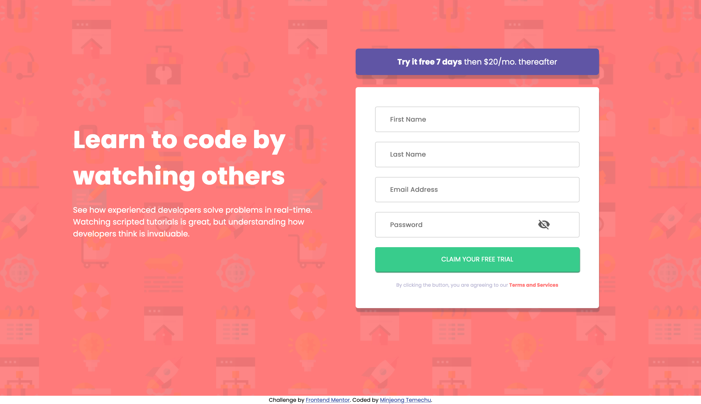
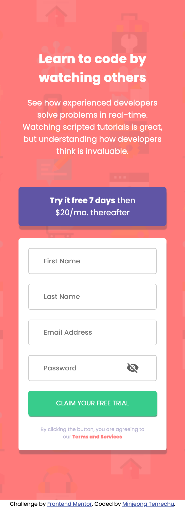

# Frontend Mentor - Intro component with sign up form solution

This is a solution to the [Intro component with sign up form challenge on Frontend Mentor](https://www.frontendmentor.io/challenges/intro-component-with-signup-form-5cf91bd49edda32581d28fd1). Frontend Mentor challenges help you improve your coding skills by building realistic projects. 

## Table of contents

- [Overview](#overview)
  - [The challenge](#the-challenge)
  - [Screenshot](#screenshot)
  - [Links](#links)
- [My process](#my-process)
  - [Built with](#built-with)
  - [What I learned](#What-I-learned)


## Overview

### The challenge

Users should be able to:

- View the optimal layout for the site depending on their device's screen size
- See hover states for all interactive elements on the page
- Receive an error message when the `form` is submitted if:
  - Any `input` field is empty. The message for this error should say *"[Field Name] cannot be empty"*
  - The email address is not formatted correctly (i.e. a correct email address should have this structure: `name@host.tld`). The message for this error should say *"Looks like this is not an email"*

### Screenshot





### Links

- Solution URL: [Add solution URL here](https://your-solution-url.com)
- Live Site URL: [Add live site URL here](https://your-live-site-url.com)

## My process

### Built with

- Semantic HTML5 markup
- CSS custom properties
- JavaScript

### What I learned

I'm fascinated to learned how you can manipulate html element with javacript.  For instance, in this project, I've implemented error messages that display when the input value's length is less than zero (typically when nothing is typed into the input box) or when the input conditions for an email doesn't match with what user typed.

In addition to meeting the challenge presented by Frontend Mentor, I personally included a feature. Users can now toggle the visibility of the password number using eye icons. 


```js

 function validateFirstName() {
    var firstName = document.getElementById("first-name").value;

    if (firstName.length == 0) {
      firstNameError.innerHTML = "First Name cannot be empty";
      errorIcon[0].style.display = "block";
      inputGroup[0].style.border =  "1.5px solid red";
      return false

    }


    firstNameError.innerHTML = "";
    errorIcon[0].style.display = "none";
    inputGroup[0].style.border =  "1px solid #cccccc";

    return true;
  }


  var passwordInput = document.getElementById("password");
  var eyeIcon = document.getElementsByTagName("img")[0];

 function seePassword() {
  if(passwordInput.type == "password") {
    eyeIcon.src = "images/eye-open.png";
    passwordInput.type = "text"

  } else {
    eyeIcon.src = "images/eye-close.png";
    passwordInput.type = "password"
  }
}
```


